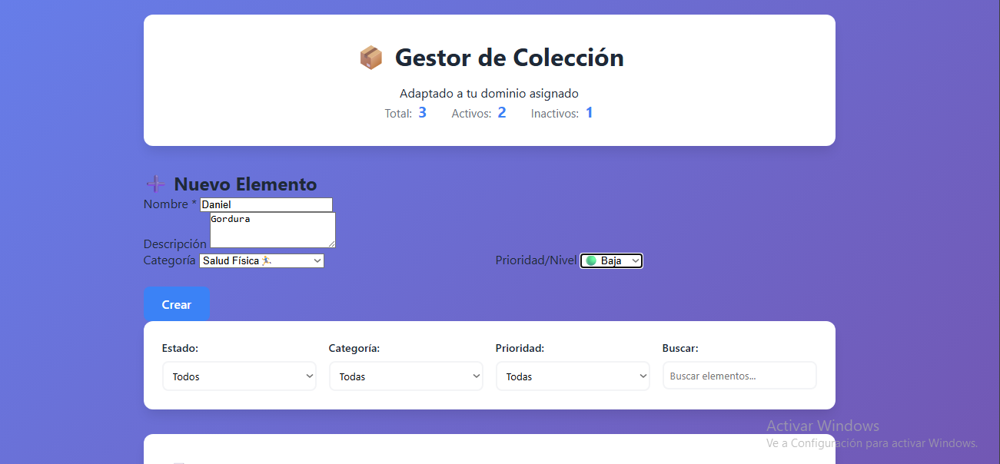
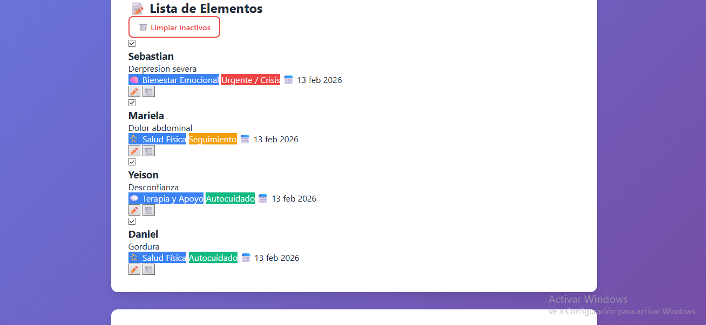

# 📦 Proyecto Semana 02: Gestor de Colección

> **🎯 ÚNICO ENTREGABLE**: Este proyecto es el **único entregable obligatorio** para aprobar la semana.

## 🏛️ Política de Dominios Únicos

**Tu dominio fue asignado por el instructor al inicio del trimestre.** Este proyecto debe implementarse completamente dentro del contexto de tu dominio asignado.

### ¿Por qué dominios únicos?

- Previene copia entre compañeros
- Fomenta implementaciones originales
- Desarrolla capacidad de abstracción
- Aplica conceptos generales a contextos específicos

---

## 🎯 Objetivos del Proyecto

Construir una aplicación completa de gestión de colección que consolide todos los conceptos aprendidos en Week-02:

- ✅ Spread & Rest operators
- ✅ Default parameters
- ✅ Array methods (map, filter, reduce, find, etc.)
- ✅ Object enhancements
- ✅ Manipulación del DOM
- ✅ LocalStorage para persistencia
- ✅ Inmutabilidad y programación funcional

---

## 📋 Descripción

Aplicación web para gestionar una colección de elementos de tu dominio asignado con las siguientes características:

### Funcionalidades Principales

1. **Crear elementos** con propiedades específicas de tu dominio
2. **Listar elementos** con filtros (todos, activos, inactivos)
3. **Editar elementos** existentes
4. **Eliminar elementos**
5. **Marcar como activo/inactivo** (o estado equivalente en tu dominio)
6. **Filtrar** por categoría y prioridad/nivel
7. **Buscar** elementos por texto
8. **Estadísticas** (total, activos, inactivos, por categoría)
9. **Persistencia** en LocalStorage

### Características Técnicas

- **Sin frameworks**: JavaScript puro (ES2023)
- **Inmutabilidad**: Nunca mutar el estado directamente
- **Array methods**: Uso intensivo de map, filter, reduce
- **Spread/Rest**: Para copiar y actualizar objetos/arrays
- **Modular**: Código organizado en funciones puras

---

## 💡 Ejemplos de Adaptación por Dominio

> **⚠️ IMPORTANTE**: Estos son ejemplos ilustrativos. Usa el dominio que te asignó tu instructor.

| Concepto Genérico | Ejemplo: Planetario 🔭 | Ejemplo: Acuario 🐠 |
|-------------------|------------------------|---------------------|
| **Elemento** | Cuerpo celeste | Especie marina |
| **Propiedades** | nombre, tipo, distancia, magnitud | nombre, tipo, tanque, cantidad |
| **Categorías** | planeta, estrella, asteroide, cometa | pez, mamífero, invertebrado, anfibio |
| **Estado activo** | Visible esta noche | En exhibición |
| **Prioridad/Nivel** | Brillo (alta/media/baja) | Peligrosidad (alta/media/baja) |
| **Estadísticas** | Por tipo, por visibilidad | Por tanque, por tipo |

---

## 🏗️ Estructura del Proyecto

```
3-proyecto/
├── README.md           # Este archivo
├── starter/
│   ├── index.html      # HTML inicial
│   ├── styles.css      # Estilos base
│   └── script.js       # Código inicial con TODOs
└── solution/
    └── script.js       # Referencia (no copiar)
```

---

## 📝 Modelo de Datos

### Estructura Genérica del Elemento

```javascript
// Adapta este modelo a tu dominio
{
  id: 1,                      // Número único (Date.now())
  name: "...",                // String - nombre del elemento
  description: "...",         // String (opcional)
  active: true,               // Boolean - estado activo/inactivo
  priority: "high",           // "low" | "medium" | "high"
  category: "...",            // Categoría específica de tu dominio
  createdAt: "2024-01-15",    // String (ISO Date)
  updatedAt: null,            // String | null

  // Propiedades específicas de tu dominio:
  // Planetario: magnitude, distance, constellation
  // Acuario: tankNumber, population, feedingSchedule
}
```

---

## 🔧 Funciones a Implementar

### 1. Estado y Persistencia

| Función | Descripción |
|---------|-------------|
| `loadItems()` | Carga elementos desde LocalStorage |
| `saveItems(items)` | Guarda elementos en LocalStorage |
| `getInitialState()` | Retorna estado inicial |

### 2. CRUD Básico

| Función | Descripción |
|---------|-------------|
| `createItem(itemData)` | Crea nuevo elemento con spread operator |
| `updateItem(id, updates)` | Actualiza elemento usando map |
| `deleteItem(id)` | Elimina elemento usando filter |
| `toggleItemActive(id)` | Alterna estado activo/inactivo |

### 3. Filtros y Búsqueda

| Función | Descripción |
|---------|-------------|
| `filterByStatus(items, status)` | Filtra por estado (all/active/inactive) |
| `filterByCategory(items, category)` | Filtra por categoría |
| `filterByPriority(items, priority)` | Filtra por prioridad |
| `searchItems(items, query)` | Busca en nombre y descripción |
| `applyFilters(items, filters)` | Aplica todos los filtros encadenados |

### 4. Estadísticas

| Función | Descripción |
|---------|-------------|
| `getStats(items)` | Calcula estadísticas usando reduce |
| `getItemsByCategory(items)` | Agrupa por categoría |

### 5. Renderizado

| Función | Descripción |
|---------|-------------|
| `renderItems(items)` | Renderiza lista usando map + template literals |
| `renderStats(stats)` | Renderiza estadísticas |
| `renderItem(item)` | Renderiza elemento individual |

---

## 🎨 Interfaz de Usuario

### Secciones Requeridas

1. **Header**: Título adaptado a tu dominio y estadísticas rápidas
2. **Formulario**: Crear/editar elementos con campos de tu dominio
3. **Filtros**: Por estado, categoría, prioridad + búsqueda
4. **Lista**: Elementos renderizados con información relevante
5. **Stats**: Resumen de estadísticas por categoría

### Estados Visuales Sugeridos

- Elementos inactivos: Opacidad reducida
- Prioridades: Colores diferentes (rojo/amarillo/verde)
- Categorías: Badges con emojis de tu dominio

---

## ✅ Criterios de Evaluación

### Funcionalidad (40 puntos)

- [ ] Crear elementos con todos los campos (10pts)
- [ ] Editar elementos existentes (8pts)
- [ ] Eliminar elementos (5pts)
- [ ] Marcar como activo/inactivo (5pts)
- [ ] Filtros funcionales (7pts)
- [ ] Búsqueda funcional (5pts)

### Código (30 puntos)

- [ ] Uso correcto de spread/rest (8pts)
- [ ] Array methods apropiados (10pts)
- [ ] Inmutabilidad mantenida (7pts)
- [ ] Código limpio y organizado (5pts)

### Persistencia y UI (30 puntos)

- [ ] LocalStorage funcionando (10pts)
- [ ] Estadísticas correctas (10pts)
- [ ] Interfaz coherente con el dominio (10pts)

**Total: 100 puntos**
**Mínimo para aprobar: 70 puntos**

---

## 🚀 Cómo Empezar

### 1. Define tu Modelo de Datos

Primero, adapta el modelo genérico a tu dominio:

```javascript
// EJEMPLO Planetario (NO es un dominio asignable)
const celestialBody = {
  id: Date.now(),
  name: "Júpiter",
  description: "El gigante gaseoso más grande del sistema solar",
  active: true,           // Visible esta noche
  priority: "high",       // Brillo: alto
  category: "planet",     // Tipo: planeta
  // Propiedades específicas:
  magnitude: -2.5,
  distance: "628 millones km",
  constellation: "Piscis"
};
```

### 2. Completa las Funciones

Abre `starter/script.js` y completa las funciones marcadas con `// TODO:`.

### 3. Orden Recomendado

1. Definir estructura de datos de tu dominio
2. Implementar `createItem()` y `renderItem()`
3. Conectar el formulario
4. Implementar `loadItems()` y `saveItems()`
5. Añadir toggle activo/inactivo y eliminar
6. Implementar filtros y búsqueda
7. Calcular y mostrar estadísticas
8. Añadir edición de elementos

---

## 💡 Pistas y Consejos

### Inmutabilidad

```javascript
// ❌ MAL: Mutar array directamente
items.push(newItem);

// ✅ BIEN: Crear nuevo array con spread
const newItems = [...items, newItem];
```

### Actualizar Elemento

```javascript
// Usa map para actualizar sin mutar
const updated = items.map(item =>
  item.id === id ? { ...item, active: !item.active } : item
);
```

### Eliminar Elemento

```javascript
// Usa filter para eliminar sin mutar
const filtered = items.filter(item => item.id !== id);
```

### Estadísticas con Reduce

```javascript
// Contar por categoría
const byCategory = items.reduce((acc, item) => {
  acc[item.category] = (acc[item.category] ?? 0) + 1;
  return acc;
}, {});
```

---

## 🎓 Conceptos Aplicados

| Concepto | Uso en el Proyecto |
|----------|-------------------|
| **Spread Operator** | Copiar arrays `[...items]`, copiar objetos `{ ...item }` |
| **Rest Parameters** | Funciones con argumentos variables |
| **Array.map()** | Transformar elementos para renderizar |
| **Array.filter()** | Filtrar por estado, categoría, búsqueda |
| **Array.reduce()** | Calcular estadísticas y agrupar |
| **Array.find()** | Encontrar elemento por ID |
| **Default Parameters** | `filterByStatus(items, status = 'all')` |
| **Object Enhancements** | Property shorthand, computed properties |

---

## 📚 Recursos

- [MDN - LocalStorage](https://developer.mozilla.org/es/docs/Web/API/Window/localStorage)
- [MDN - Métodos de Array](https://developer.mozilla.org/es/docs/Web/JavaScript/Reference/Global_Objects/Array)
- [JavaScript.info - Métodos de Array](https://javascript.info/array-methods)

---

## ⏱️ Tiempo Estimado

- **Definir modelo de datos**: 20 minutos
- **Implementación básica**: 1.5 horas
- **Filtros y búsqueda**: 30 minutos
- **Estadísticas**: 20 minutos
- **Refinamiento y testing**: 20 minutos

**Total: ~3 horas**

---

## 📋 Entregables

1. **Código funcional** adaptado a tu dominio asignado
2. **README personal** explicando tu implementación específica

# 📌 README – Gestor de Bienestar Personal (Implementación Personal)
## 👋 Descripción general

Este proyecto es una aplicación web en JavaScript puro que permite gestionar elementos relacionados con el bienestar personal y salud mental.
Como objetivo de este era poder crear, editar, marcar como activos/inactivos y filtrar actividades o recursos de autocuidado, terapia y crecimiento personal.

La aplicación funciona completamente en el navegador y guarda la información usando LocalStorage, por lo que los datos se mantienen aunque se cierre la página.

## 🧠 Dominio: Bienestar y Salud Mental

Actividades de autocuidado

Recordatorios de terapia

Ejercicios de meditación

Hábitos de salud física

Objetivos de crecimiento personal

Cada elemento representa una acción o recurso que ayuda al bienestar del usuario.

## 🗂️ Categorías personalizadas

Definí las siguientes categorías en el archivo script.js:

* 🧠 Bienestar Emocional

* 💬 Terapia y Apoyo

* 🧘 Meditación

* 🏃‍♂️ Salud Física

* 🌱 Crecimiento Personal

Cada categoría tiene su nombre y su emoji para mejorar la experiencia visual.

## 🚦 Prioridades personalizadas

Las prioridades fueron adaptadas al contexto de bienestar:

* 🔴 Urgente / Crisis

* 🟠 Seguimiento

* 🟢 Autocuidado

Esto permite identificar rápidamente qué elementos requieren más atención.

* ⚙️ Funcionalidades implementadas
* ✔️ CRUD completo

Crear nuevos elementos

Editar elementos existentes

Eliminar elementos

Marcar elementos como activos o inactivos

## 💾 Persistencia

Uso de LocalStorage para guardar los datos del usuario.

## 🔍 Filtros y búsqueda

Filtro por estado: todos / activos / inactivos

Filtro por categoría

Filtro por prioridad

Búsqueda por nombre y descripción

## 📊 Estadísticas

Total de elementos

Cantidad de activos

Cantidad de inactivos

Conteo por categoría

## 🖥️ Interfaz

La interfaz es simple y clara:

Formulario para crear y editar elementos

Lista dinámica que se actualiza en tiempo real

Badges con colores y emojis

Estadísticas visibles para ver el progreso
```
📁 Estructura del proyecto
/Week-02
│── index.html
│── styles.css
│── README.md
│── Img 📁
│        │── img1.png
│        │── img2.png
│        └── img3.png   
└── Starter 📁
         └── script.js
```
## ▶️ Cómo usar el proyecto

Abrir index.html en el navegador

Crear un nuevo elemento desde el formulario

Usar los filtros para organizar los elementos

Editar o eliminar según sea necesario

Los datos se guardan automáticamente

## ✍️ Personalización realizada

Dominio cambiado de ejemplo genérico a bienestar personal

Categorías y prioridades adaptadas al contexto emocional

Textos de la interfaz en español

Uso de emojis para mejorar la claridad visual

## 🧩 Conclusión

Este proyecto muestra la aplicación práctica de:

Manejo de estado en JavaScript

Funciones puras (map, filter, reduce)

Persistencia en LocalStorage

Manipulación del DOM

Separación de lógica y renderizado

Además, el dominio lo hace útil para organizar actividades de autocuidado y apoyo emocional en la vida diaria.


#
3. **Capturas de pantalla** de la aplicación funcionando






4. **Todo el código debe usar**:
   - Nomenclatura técnica en inglés
   - Comentarios en español
   - Sintaxis ES2023 exclusivamente

---

_Proyecto Week-02 - JavaScript Moderno Bootcamp_
